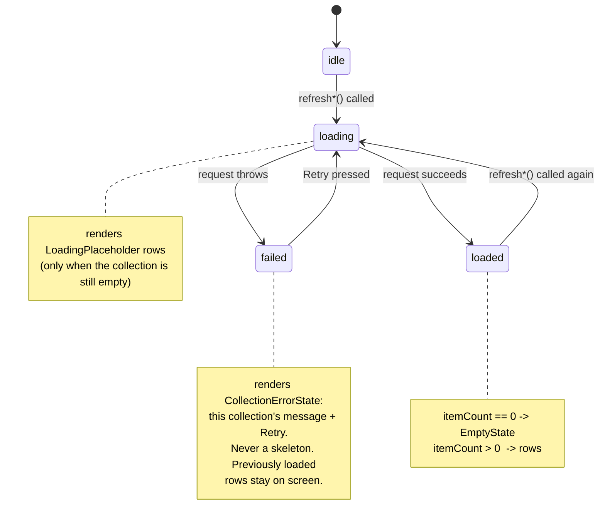
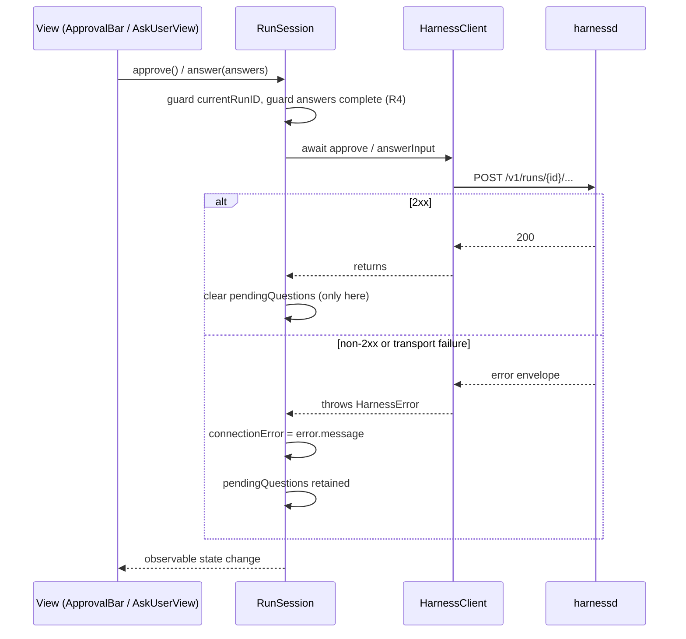
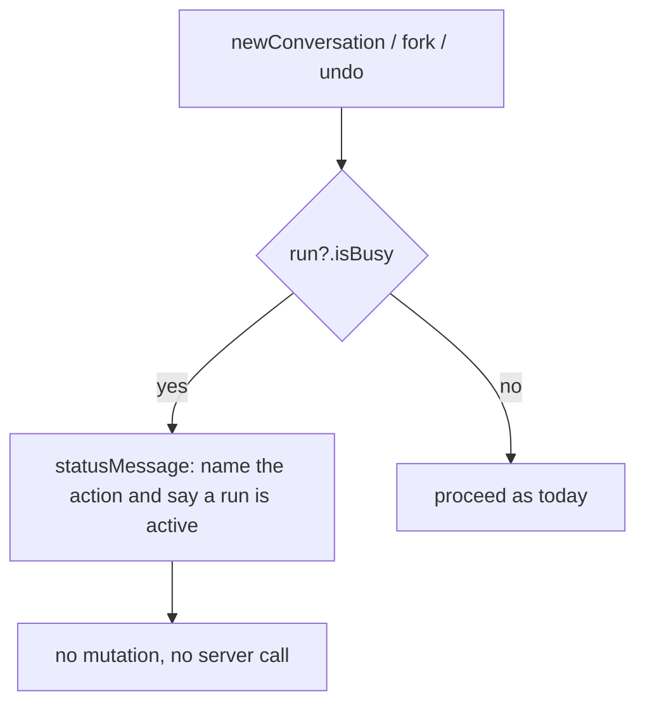

# Plan: macapp GUI correctness, safety, and accessibility hardening (epic #991)

## 2026-07-31 Repair Phase Addendum

PR #1021 is being repaired after an independent production review at exact head
`1f2444b2480b5832139318e4fa034f4240d92b8d`. The repair branch merged current
`origin/main` at `b3afc7ec487c60762a91a1219ceb92c523ef0e78` and must preserve the
#1008/#1028 persisted-conversation replay and terminal-reconciliation behavior.
The complete repair impact map is
`2026-07-31-pr-1021-gui-hardening-repair-impact-map.md`.

Confirmed repair scope uses strict red-green TDD for:

- answer-request generation ownership across reset/new conversations;
- generation-safe pending-question fetches;
- single-flight approve/deny/steer and non-destructive steering failure;
- cancel/rearm or generation-safe autoscroll completion;
- latest-request ownership for project collection and conversation loads;
- identical prompt-history recall bookkeeping;
- stale-row retention, lifecycle disabled reasons, and the missing rewind busy guard.

External cron/callback run-control binding remains owned by #1007 and is not
duplicated here. Settings-specific root-cause work and installed-app smokes
remain pending the separately coordinated investigation and issue #1020. The
repair phase may not merge until the current-scope automated gates, independent
review, and remaining live proof obligations are reconciled.

Automated repair status: complete on the isolated repair branch. The focused
integration run passed 93 tests / 12 suites; the full Swift build, 303-test /
55-suite Swift test run, and strict recursive format lint passed; the relevant
Go packages passed; and `./scripts/test-regression.sh` passed in the logged-in
GUI context with 85.6% coverage and zero uncovered functions. Installed-app
smokes and the separate Settings investigation remain required before the
overall PR is considered fully proven.

## Summary

Eight scoped slices harden the SwiftUI macOS app (`macapp/`) in three areas that are currently wrong rather than merely unpolished:

1. **Correctness** — the transcript autoscrolls even when the operator has scrolled up to read; failed collection fetches render as permanent loading skeletons; run-control calls (`cancel`/`approve`/`deny`/`answerInput`) throw their acknowledgement away with `try?`.
2. **Safety** — conversation lifecycle actions (new / fork / undo) run during an active run with no guard; delete and undo fire immediately with no confirmation and no statement of what will be lost; the server's `409 rewind_refused` safety refusal is collapsed into a generic status string with no distinct force path.
3. **Accessibility & feedback** — conversation and model rows are `onTapGesture` targets rather than controls, the per-model exposure `Toggle` has no accessibility label, and a successful model fetch's status message is erased by the reload that follows it.

Each slice is delivered test-first (epic requirement) against the existing Swift Testing suites in `macapp/Tests/`.

---

## Problem Frame

**Who is hurt.** The operator reading a long streamed transcript, the operator recovering from a flaky daemon, and the operator using the keyboard or VoiceOver. All three currently get either a silent failure or a destructive action with no warning.

**Why now.** The app has reached the point where its remaining defects are behavioural, not visual. Every finding below was verified against source at `8f2e412`:

| # | Finding | Evidence (repo-relative) |
|---|---|---|
| F1 | Autoscroll never yields to the user. `pinnedToBottom` is initialised `true` and never mutated. | `macapp/Sources/GoCodeUI/ChatView.swift:90` (declaration), `:128` (only read site) |
| F2 | `.failed` renders identically to `.loading` — endless skeletons, no message, no retry. `CollectionLoadState` carries no failure detail; the reason lands in the single-slot `statusMessage` shared by 8 collections. | `macapp/Sources/GoCodeUI/DesignSystem/CollectionLoadState.swift:9-18`; `macapp/Sources/GoCodeUI/ActivityView.swift:46`; `macapp/Sources/GoCodeUI/ProjectSession.swift:93-116, 205-300`; `macapp/Sources/GoCodeUI/ModelSettingsView.swift:18, 182, 235` |
| F3 | Run-control acknowledgements discarded. `try?` on cancel/approve/deny/answerInput; `pendingQuestions` cleared *before* the server answers; a freeform answer edited back to empty counts as answered. | `macapp/Sources/GoCodeUI/RunSession.swift:139, 144, 149, 171-172`; `macapp/Sources/GoCodeUI/ChatView.swift:855` |
| F4 | Conversation lifecycle unguarded during a run: `newConversation`, `fork`, `undo` never consult `run?.isBusy`. | `macapp/Sources/GoCodeUI/ProjectSession.swift:356-382` |
| F5 | Delete and undo are immediate and unpreviewed; delete is a bare destructive `Button` in a context menu. | `macapp/Sources/GoCodeUI/ProjectSession.swift:345, 374`; `macapp/Sources/GoCodeUI/SessionsView.swift:59`; `macapp/Sources/GoCodeUI/SettingsView.swift:198` |
| F6 | `rewind` collapses every `HarnessError` — including the server's deliberate `rewind_refused` — into `statusMessage` text, so no force path can exist. The dead `forceNext` toggle was removed rather than wired, with a NOTE saying exactly this. | `macapp/Sources/GoCodeUI/ProjectSession.swift:386-399`; `macapp/Sources/GoCodeUI/SessionsView.swift:144-152`; server side: `internal/server/http_conversations.go:370`; client contract note: `macapp/Sources/HarnessKit/ClientConversations.swift:126-130` |
| F7 | Prompt history is append-only with no cursor, no forward navigation, and no production key handler — `recallPreviousPrompt()` has no call site in `Sources/`. | `macapp/Sources/GoCodeUI/RunSession.swift:26, 74, 205-208`; composer has no key handling: `macapp/Sources/GoCodeUI/ChatView.swift:886-894` |
| F8 | Accessibility and settings feedback gaps: rows are tap gestures, the exposure `Toggle` label is hidden with no replacement, `load()` clears the status a successful fetch just set, provider `Remove` is immediate. | `macapp/Sources/GoCodeUI/SessionsView.swift:44`; `macapp/Sources/GoCodeUI/SettingsView.swift:158`; `macapp/Sources/GoCodeUI/ModelSettingsView.swift:356-365` (toggle), `:45-50` + `:58-66` (status erased), `:291-295` (immediate Remove) |

**Constraint that shapes every slice.** This package has no SwiftUI view-rendering tests. The three established patterns are: pure value-type tests (`CollectionLoadStateTests`, `MarkdownBlockTests`, `DesignTokenTests`), observable-session tests driven through a `URLProtocol` stub (`ProjectSessionActivityTests`, `RunSessionConversationStreamTests`), and source-scan reachability tests (`TranscriptFeatureReachabilityTests`). Every unit below must therefore push its decision logic **out of the view body** into something one of those three patterns can reach.

---

## Requirements

Traced to the findings above and to the epic's acceptance criteria.

| ID | Requirement | Source |
|---|---|---|
| R1 | Auto-scroll to the transcript bottom happens only while the view is already at (or within a small threshold of) the bottom. Scrolling up during a stream must not be yanked back. | F1 / #992 |
| R2 | A failed collection load renders an inline error naming the failure reason for *that* collection plus a retry affordance, never a loading skeleton. A `.failed` state must not be indistinguishable from `.loading`. | F2 / #993 |
| R3 | Every run-control call surfaces its result. A rejected or failed `cancel`/`approve`/`deny`/`answerInput` produces visible feedback and does not leave the UI asserting the action succeeded. Pending questions clear only after the server accepts the answers. | F3 / #994 |
| R4 | An answer set is submittable only when every question has a non-blank answer. | F3 / #994 |
| R5 | `newConversation`, `fork`, and `undo` refuse (with an explanation) while a run is active, at the shared `ProjectSession` boundary so every call site is covered. | F4 / #995 |
| R6 | Deleting a conversation and undoing a turn require an explicit confirmation that states what will be lost before it is lost. | F5 / #996 |
| R7 | A `rewind_refused` refusal is represented structurally (not as prose in `statusMessage`) and offers a **second, distinctly worded** confirmation that calls `rewind(force: true)`. A refusal is never auto-retried with force. | F6 / #997 |
| R8 | Up/Down in the composer navigate prompt history with a cursor: repeated Up walks backwards, Down walks forwards and back out to the pre-recall draft, and navigation declines rather than destroys an in-progress draft. | F7 / #998 |
| R9 | Conversation rows and model rows are real controls (focusable, actionable, and named); the per-model exposure toggle has an accessibility label naming the model. | F8 / #999 |
| R10 | Model-settings status feedback survives the reload that follows the action that produced it; destructive provider removal is confirmed. | F8 / #999 |
| R11 | Every slice lands test-first, and `swift build`, `swift test`, and `swift format lint --strict` are green per slice. | Epic #991 |

---

## Key Technical Decisions

**KTD-1 — Run-control acknowledgement model: await the call, surface the error, no new transport work.**
`HarnessClient.cancel/approve/deny/answerInput` all route through `sendVoid`, which already throws a typed `HarnessError` on any non-2xx (`macapp/Sources/HarnessKit/HarnessClient.swift:327-361`). The defect is purely that `RunSession` wraps them in `try?`. Fix: `await` the call inside the existing `Task`, catch `HarnessError`, and publish the message on a `RunSession`-owned observable. Reuse the existing `connectionError` slot — it is already rendered by `InlineRunStatus` (`ChatView.swift:716`) and by definition means "the last thing this session asked the server for did not work". *Rejected:* a new per-control error enum and a new banner — one more surface for the same information.

**KTD-2 — `CollectionLoadState.failed` gains an associated message.**
`statusMessage` is a single last-writer-wins slot shared by 8 collections (`ProjectSession.swift:205-300`), so an inline error next to a failed list cannot truthfully name *that* list's failure by reading it. Change `case failed` → `case failed(String)` and add `showsError` / `showsPlaceholder(itemCount:)` helpers alongside the existing `showsEmptyState(itemCount:)` so views stop hand-rolling `state != .loaded && items.isEmpty`. This is the widest diff in the plan (six files) and is why U2 runs early — a fail-fast placement. *Rejected:* a parallel `failureMessage` dictionary keyed by collection — two things to keep in sync, and nothing stops them diverging.

**KTD-3 — Retry is a closure supplied by the view, not a registry.**
Each load state already pairs one-to-one with a `refresh*` method. `CollectionErrorState(message:retry:)` takes `{ Task { await project.refreshConversations() } }`. No mapping table, no protocol.

**KTD-4 — One shared destructive-confirmation presentation, built once in U5 and reused by U6 and U8.**
The app already uses `.alert` with a `Binding` derived from an optional item (`SessionsView.swift:184-200`) — that shape is the pattern, extracted into one `DestructiveConfirmation` component so delete, undo, rewind, force-rewind, and provider-remove read identically and cannot drift apart in wording severity.

**KTD-5 — Delete/undo previews are derived client-side. There is no server dry-run.**
Verified: `POST /v1/conversations/{id}/undo` mutates and *then* reports `removed_from_step` / `remaining_messages` (`internal/server/http_conversations.go:588-616`); `handleDeleteConversation` has no preview mode (`:831`). So a pre-action preview must be composed from data the app already holds: `ConversationInfo.displayTitle` + `messageCount` for delete, and the last `.userPrompt` item in `run.transcript.items` for undo. Server changes stay out of scope.

**KTD-6 — Match `rewind_refused` on `HarnessError.code`, not the HTTP status.**
The server passes a computed status to `writeError(w, code, "rewind_refused", …)` (`internal/server/http_conversations.go:370`), so the code string is the stable part of the contract. `ProjectSession.rewind` returns a typed outcome and records `rewindRefusal` (point id + server message) instead of stringifying into `statusMessage`.

**KTD-7 — Prompt-history cursor is a pure value type; "cursor-aware" is approximated by draft state, not caret position.**
`PromptHistory` (entries + cursor index + a stashed pre-recall draft) is a plain struct, unit-testable without a view. The literal reading of #998 — "cursor-aware", i.e. only recall when the text caret is on the first/last line — is **not implementable on this package's platform floor**: `Package.swift` pins `.macOS(.v14)`, and a SwiftUI `TextField`/`TextEditor` selection binding (`TextSelection`) is a macOS 15 API. Approximation: Up recalls only when the draft is empty or unchanged from the current recall; otherwise it declines and lets the field handle the key normally. See Assumptions and the deviation note.

**KTD-8 — Autoscroll pinning is a pure model fed by geometry, not a view-local `Bool`.**
`TranscriptScrollPin` (threshold + `mutating func update(distanceFromBottom:)` + `isPinned`) is unit-testable; the view supplies the distance via a `GeometryReader` on the existing bottom anchor read in a named coordinate space. `.onScrollGeometryChange` / `.onScrollPhaseChange` are macOS 15 APIs and are unavailable here; `scrollPosition(id:)` reports the leading visible item, which is the wrong end of the scroll view for this decision.

**KTD-9 — Guards live in `ProjectSession`, not at each call site.**
`newConversation` has four callers (`SessionsView.swift:17`, `ChatView.swift:901`, `ConversationChrome.swift:32`, and `ProjectSession.deleteConversation` itself at `:349`); `fork` and `undo` each have three (`ChatView.swift:343/351`, `ConversationChrome.swift:34/35`, `SettingsView.swift:197/198`). One guard inside each `ProjectSession` method is a smaller diff than a `.disabled(...)` per call site *and* is the only version that cannot be bypassed by a caller added later. Disabled-state polish on the controls is additive, not the fix.

---

## High-Level Technical Design

### Collection load-state rendering (U2)



### Run-control acknowledgement (U3) and lifecycle guard (U4)





---

## Implementation Units

Execution is **serial** in the order below. The epic's logical dependency chain (U3 → U4 → U5 → U6) is preserved, and U2 — the widest diff — is front-loaded so a bad shape fails fast. Units that are logically independent (U1, U2, U7) are still ordered rather than parallel because they share files: U1, U3, and U7 all edit `ChatView.swift`; U2, U4, U5, U6 all edit `ProjectSession.swift`.

### U1 — Stop transcript autoscroll when the user has scrolled up

**Goal.** Streaming output stops yanking the view to the bottom once the operator has scrolled back to read.

**Requirements.** R1, R11.

**Dependencies.** None.

**Files.**
- `macapp/Sources/GoCodeUI/TranscriptScrollPin.swift` (new)
- `macapp/Sources/GoCodeUI/ChatView.swift` (modify `TranscriptView`, lines ~82-132)
- `macapp/Sources/GoCodeUI/DesignSystem/Layout.swift` (add the pin threshold token)
- `macapp/Tests/GoCodeUITests/TranscriptScrollPinTests.swift` (new)

**Approach.**
1. New value type owning the decision:
   ```
   struct TranscriptScrollPin {
       var isPinned: Bool          // starts true — a fresh transcript is at the bottom
       mutating func update(distanceFromBottom: CGFloat)   // <= threshold -> pinned
   }
   ```
   Threshold as a `Layout` token (`Layout.autoscrollPinThreshold`), consistent with every other measurement in this module living in the token layer.
2. In `TranscriptView`, wrap the existing bottom anchor (`ChatView.swift:103`) in a `GeometryReader` and read its frame in a `.coordinateSpace(name:)` attached to the `ScrollView`; feed `scrollViewHeight - anchorMinY` into `pin.update(distanceFromBottom:)`.
3. `scrollIfPinned` (`:127`) now guards on `pin.isPinned`. A programmatic `scrollTo` re-enters the geometry callback with distance ≈ 0, which re-pins — correct and self-consistent.
4. Keep the existing `withAnimation` and both `onChange` triggers unchanged.

**Patterns to follow.** `LoadingPlaceholder` (a small view whose behaviour is driven by injected values); token-first measurements per `DesignTokenTests`; `MarkdownBlock` as the precedent for "the logic is a value type, the view just renders it".

**Test scenarios** (`macapp/Tests/GoCodeUITests/TranscriptScrollPinTests.swift`):
- *Happy:* a new pin is pinned; `update(distanceFromBottom: 0)` keeps it pinned; `scrollIfPinned` therefore fires.
- *Core regression:* `update(distanceFromBottom: threshold + 1)` → `isPinned == false`. This is the assertion that fails if `pinnedToBottom` is ever reverted to a never-mutated constant.
- *Edge:* distance exactly `threshold` → still pinned (boundary is inclusive, asserted explicitly).
- *Edge:* returning to the bottom (`update(0)`) after unpinning → re-pinned, so autoscroll resumes without a relaunch.
- *Edge:* negative distance (overscroll / bounce) → pinned, not unpinned.
- *Reachability:* extend `TranscriptFeatureReachabilityTests` to assert `ChatView.swift` contains `pin.update(distanceFromBottom:` and `guard pin.isPinned` — the "wired to production" check that this module's existing tests use, and the one that catches a pure-model-with-no-call-site regression.

**Execution note.** Strict TDD: write `TranscriptScrollPinTests` red first, implement the value type, then wire the view and add the reachability assertion.

**Verification.** From `macapp/`: `swift build`, `swift test`, `swift format lint --strict --recursive Sources Tests`.

---

### U2 — Failed collection loads render an inline error with retry

**Goal.** A failed fetch says what failed, for which collection, and offers Retry. No endless skeletons.

**Requirements.** R2, R11.

**Dependencies.** None (but ordered first among the wide-diff units).

**Files.**
- `macapp/Sources/GoCodeUI/DesignSystem/CollectionLoadState.swift` (`failed(String)`, `showsError`, `showsPlaceholder(itemCount:)`, new `CollectionErrorState` view)
- `macapp/Sources/GoCodeUI/ProjectSession.swift` (all `= .failed` assignments: lines ~217, 224, 231, 243, 259, 272, 284, 293)
- `macapp/Sources/GoCodeUI/ActivityView.swift` (tasks + runs sections, lines ~33-64)
- `macapp/Sources/GoCodeUI/SessionsView.swift` (conversations list ~24-65; checkpoints ~154-182)
- `macapp/Sources/GoCodeUI/SettingsView.swift` (providers ~49; models ~131)
- `macapp/Sources/GoCodeUI/ModelSettingsView.swift` (`loadState` ~18, 47-50, 182, 235)
- `macapp/Tests/GoCodeUITests/CollectionLoadStateTests.swift` (extend)
- `macapp/Tests/GoCodeUITests/ProjectSessionLoadStateTests.swift` (new)

**Approach.**
1. `CollectionLoadState` becomes `idle | loading | loaded | failed(String)`. Keep `showsEmptyState(itemCount:)` semantics exactly. Add:
   - `var showsError: Bool` / `var errorMessage: String?`
   - `func showsPlaceholder(itemCount: Int) -> Bool` — `self == .loading || self == .idle`, and `itemCount == 0`. Critically **false** for `.failed`, which is the bug.
2. `CollectionErrorState(message:retry:)` — an icon + the server's own message (verbatim, per the existing convention in `ModelSettingsModel.fetch`) + a `Retry` button. Mirrors `StartupFailureView` (`AppShell.swift:245-268`), which is already the app's "this failed, here is the reason, try again" shape.
3. `ProjectSession` failure branches become `.failed(error.localizedDescription)`. Keep the existing `statusMessage` write — it is the cross-cutting toast and is asserted by `ProjectSessionActivityTests`; U2 must not regress those two tests.
4. Each consuming view: `showsPlaceholder` → skeletons, `showsError` → `CollectionErrorState` with that collection's `refresh*` as retry, `showsEmptyState` → `EmptyState` (unchanged), else rows.
5. `ModelSettingsModel.load()` already sets `.failed`; give it the message too and render `CollectionErrorState` in both `providerList` and `modelList` instead of the current `loadState != .loaded` skeleton branches.

**Patterns to follow.** `CollectionLoadStateTests` (pure state-table tests); `ProjectSessionActivityTests`' `URLProtocol` stub on a fixed loopback port for session-level tests; verbatim server messages, as `ModelSettingsView.swift:62-66` argues.

**Test scenarios.**
- `CollectionLoadStateTests` (extend): `.failed("boom").showsEmptyState(itemCount: 0) == false` (existing guarantee, preserved); `.failed("boom").showsPlaceholder(itemCount: 0) == false` — **the core regression**, red before the change; `.loading.showsPlaceholder(itemCount: 0) == true`; `.loading.showsPlaceholder(itemCount: 3) == false` (a refresh over existing rows must not blank them); `.failed("boom").errorMessage == "boom"`; `.loaded.showsError == false`.
- `ProjectSessionLoadStateTests` (new, stub-driven like `ProjectSessionActivityTests`):
  - *Error:* stub `/v1/conversations/` → 500 with `{"error":{"code":"boom","message":"conversations exploded"}}`; `await project.refreshConversations()`; expect `project.conversationsLoadState.errorMessage` contains `conversations exploded` **and** `project.conversations.isEmpty`.
  - *Integration:* stub 500 then 200; refresh, assert failed-with-message; refresh again (the retry path), assert `.loaded` and the rows present — proves Retry actually recovers.
  - *Edge:* a failed refresh after a successful one must keep the previously loaded rows (the `refreshCatalog` guarantee `ProjectSessionActivityTests` already asserts for `models`, extended to the new state shape).
  - *Per-collection isolation:* stub `/v1/models` → 500 while `/v1/providers` → 200; assert `modelsLoadState.showsError` and `providersLoadState == .loaded` — the reason `failed` carries its own message rather than reading the shared `statusMessage`.
- *Reachability:* assert `Sources/GoCodeUI` contains `CollectionErrorState(` (the component has production call sites) — the `TranscriptFeatureReachabilityTests` pattern.

**Execution note.** Strict TDD. Land the `CollectionLoadStateTests` additions red first; the enum change is what turns them green, and it is also what breaks compilation across the six views — expected and intended.

**Verification.** `swift build`, `swift test`, `swift format lint --strict --recursive Sources Tests`. `ProjectSessionActivityTests` must still pass unmodified in intent.

---

### U3 — Reliable run-control acknowledgements

**Goal.** No run-control call silently fails, and the UI never claims an unacknowledged action succeeded.

**Requirements.** R3, R4, R11.

**Dependencies.** None. **Must precede U4** (U4's guard messaging reuses this unit's feedback slot).

**Files.**
- `macapp/Sources/GoCodeUI/RunSession.swift` (`cancel` ~128-140, `approve` ~142-145, `deny` ~147-150, `answer` ~169-173)
- `macapp/Sources/GoCodeUI/AskUserAnswers.swift` (new — the completeness predicate)
- `macapp/Sources/GoCodeUI/ChatView.swift` (`AskUserView` Send `disabled` at ~855)
- `macapp/Tests/GoCodeUITests/RunControlAckTests.swift` (new)
- `macapp/Tests/GoCodeUITests/AskUserAnswersTests.swift` (new)

**Approach.**
1. Replace each `try? await client.…` with an awaited call in a do/catch that sets `connectionError` from `HarnessError.message` (or `localizedDescription` for transport errors) — the same catch shape `steer()` already uses correctly at `RunSession.swift:158-166`. `steer` is the in-repo reference implementation; the other four are the outliers.
2. `answer(_:)`: validate first (step 3), then `await client.answerInput`, and clear `pendingQuestions` **only after** it returns. On failure keep the prompt on screen and set `connectionError`.
3. `AskUserAnswers.isComplete(prompt:answers:)` — every question id present with a non-blank trimmed value. Used by both `RunSession.answer`'s guard (root cause: covers any future caller) and `AskUserView`'s `disabled` (so the button reflects the same rule). Replaces the current `answers.count < prompt.questions.count`, which counts a field edited back to `""` as answered.
4. `cancel()`'s two-stage interrupt semantics stay exactly as they are; only the discarded acknowledgement changes. A failed first cancel must **not** leave `cancelRequested == true`, or the operator's second press force-kills a run whose cancel never actually reached the server — reset it in the catch.

**Patterns to follow.** `RunSession.steer()` (the correct error handling already in this file); `RunSessionConversationStreamTests`' per-file `URLProtocol` stub with per-path queued responses — it can script a 409/500 on `/v1/runs/{id}/approve` directly.

**Test scenarios** (`RunControlAckTests.swift`, stub-driven):
- *Error / core regression:* `POST /v1/runs/run_1/approve` → 500; call `approve()`; expect `connectionError != nil`. Fails today because `try?` swallows it.
- *Error:* `POST …/deny` → 500 → `connectionError` set.
- *Happy:* `POST …/input` → 200 → `pendingQuestions == nil`.
- *Error / core regression:* `POST …/input` → 409 → `pendingQuestions` is **still non-nil** and `connectionError` is set. Fails today because line 171 clears it before the call.
- *Edge:* `cancel()` where `POST …/cancel` → 500 → `connectionError` set **and** a second `cancel()` still issues a cooperative cancel rather than force-abandoning the stream.
- *Happy:* `cancel()` with 200 → no `connectionError`, `cancelRequested` set, second press marks cancelled (existing behaviour, pinned).
- `AskUserAnswersTests`: all-answered → complete; one id missing → incomplete; a value of `""` → incomplete; a value of `"   "` → incomplete (**the finding**); a single freeform question answered → complete.

**Execution note.** Strict TDD, one red test per behaviour before the corresponding `try?` is removed.

**Verification.** `swift build`, `swift test`, `swift format lint --strict --recursive Sources Tests`.

---

### U4 — Guard conversation lifecycle during an active run

**Goal.** New / fork / undo cannot silently race a running turn.

**Requirements.** R5, R11.

**Dependencies.** U3.

**Files.**
- `macapp/Sources/GoCodeUI/ProjectSession.swift` (`newConversation` ~356, `fork` ~362, `undo` ~374)
- `macapp/Tests/GoCodeUITests/ProjectSessionLifecycleGuardTests.swift` (new)

**Approach.**
1. Each of the three methods gains an early guard on `run?.isBusy == true`: set `statusMessage` naming the action and the reason ("Stop the running task before starting a new conversation."), then return without mutating state or calling the server.
2. `deleteConversation`'s internal `newConversation()` call (`:349`) inherits the guard automatically — that call happens only after a successful server delete, and if a run is active on the deleted conversation the guard's refusal is the correct outcome to surface rather than a silent reset. Assert this explicitly in a test so the interaction is intentional, not incidental.
3. Do **not** add `.disabled(...)` to the six UI call sites in this unit; the shared guard is the correctness fix. Control-state polish is out of scope (see Scope Boundaries).

**Patterns to follow.** `ProjectSession`'s existing `guard let client …` early-return style; `ProjectSessionActivityTests`' stub for driving a session with a scripted daemon.

**Test scenarios** (`ProjectSessionLifecycleGuardTests.swift`, stub-driven):
- *Error / core regression:* with a busy run (drive `run.transcript` into a running state via a scripted `run.started` frame, or submit against a stub that never terminates), call `newConversation()`; expect the conversation id is unchanged and `statusMessage` mentions the active run. Fails today.
- *Error:* `await fork()` while busy → **no** `POST /v1/conversations/{id}/fork` recorded by the stub, and `statusMessage` set. Asserting on recorded requests (the `ConversationStreamStub.requests` pattern) is what proves the server was never called.
- *Error:* `await undo()` while busy → no `POST …/undo` recorded.
- *Happy:* with no active run, all three behave exactly as before (fork rebinds, undo reloads, new resets) — the guard must not break the idle path.
- *Integration:* run completes → the previously refused `fork()` now succeeds, proving the guard is state-based and not sticky.

**Execution note.** Strict TDD.

**Verification.** `swift build`, `swift test`, `swift format lint --strict --recursive Sources Tests`.

---

### U5 — Delete and undo require a preview confirmation

**Goal.** Nothing destructive happens without first stating what will be lost. Builds the shared confirmation presentation that U6 and U8 reuse.

**Requirements.** R6, R11.

**Dependencies.** U4.

**Files.**
- `macapp/Sources/GoCodeUI/DesignSystem/DestructiveConfirmation.swift` (new — shared presentation + the preview-text builders)
- `macapp/Sources/GoCodeUI/SessionsView.swift` (delete path ~59, 108-110)
- `macapp/Sources/GoCodeUI/SettingsView.swift` ("Undo Last Prompt" ~198)
- `macapp/Sources/GoCodeUI/ChatView.swift` (`MessageActions` undo ~350-357)
- `macapp/Sources/GoCodeUI/ConversationChrome.swift` (menu undo ~35)
- `macapp/Tests/GoCodeUITests/DestructiveConfirmationTests.swift` (new)

**Approach.**
1. `DestructiveConfirmation` — a small `Identifiable` value (`title`, `message`, `confirmLabel`, `action`) plus a `View` extension presenting it via the `.alert` + optional-item `Binding` shape already used at `SessionsView.swift:184-200`. One presentation, five call sites (delete, undo, rewind, force rewind in U6, provider remove in U8).
2. Preview text as **pure functions** so they are testable without a view (KTD-5, client-derived):
   - `DeletePreview.message(for: ConversationInfo)` → title + `messageCount` when known, and an explicit "message count unknown" wording when the server omitted it. Never fabricate a count.
   - `UndoPreview.message(lastPrompt: String?)` → quotes the truncated last user prompt from `run.transcript.items`, or a neutral "the last turn" when the transcript holds none.
3. Route all four undo entry points and the delete entry point through the shared confirmation. `ProjectSession.deleteConversation` / `undo` themselves stay unchanged in behaviour — confirmation is a presentation concern and the guard from U4 is the model-level protection.

**Patterns to follow.** `CheckpointsView`'s existing alert (`SessionsView.swift:184-200`) — same `Binding` derivation, same "Cancel is `.cancel`, the destructive verb is `.destructive`" role assignment, same "it cannot be undone" plainness.

**Test scenarios** (`DestructiveConfirmationTests.swift`):
- *Happy:* `DeletePreview.message` for a conversation with `messageCount == 12` contains the title and `12`.
- *Edge:* `messageCount == nil` → the message states the count is unknown and contains **no** invented number (assert the string has no digits, or matches the explicit unknown wording).
- *Edge:* a very long conversation title is truncated to a bounded length (assert an upper bound), so the alert cannot become unreadable.
- *Happy:* `UndoPreview.message(lastPrompt: "fix the parser")` quotes it; `lastPrompt: nil` → the neutral wording.
- *Edge:* a multi-line prompt is flattened to one line.
- *Reachability:* `Sources/GoCodeUI` contains no bare `Button("Delete", role: .destructive) { delete(` immediate-action shape and does contain `destructiveConfirmation(` at the delete and undo sites — the source-scan pattern, which is the only available way to assert the confirmation is actually in the path on this test stack.

**Execution note.** Strict TDD for the preview builders; the presentation wiring is covered by the reachability assertions.

**Verification.** `swift build`, `swift test`, `swift format lint --strict --recursive Sources Tests`. Manual smoke required (see Verification Contract) because alert presentation itself is not headlessly assertable.

---

### U6 — Surface `rewind_refused` structurally and offer a distinct force confirmation

**Goal.** The server's safety refusal becomes a real, actionable state with its own, more severe second confirmation.

**Requirements.** R7, R11.

**Dependencies.** U5 (shared confirmation).

**Files.**
- `macapp/Sources/GoCodeUI/ProjectSession.swift` (`rewind` ~386-399, plus a new `rewindRefusal` observable)
- `macapp/Sources/GoCodeUI/SessionsView.swift` (`CheckpointsView` ~142-201, including removal of the stale NOTE at ~144-152)
- `macapp/Tests/GoCodeUITests/ProjectSessionRewindTests.swift` (new)

**Approach.**
1. Add `public private(set) var rewindRefusal: RewindRefusal?` where `RewindRefusal` is `{ pointID: String, message: String }`. In `rewind`'s `catch let error as HarnessError`, branch on `error.code == "rewind_refused"` (KTD-6): set `rewindRefusal` and leave `statusMessage` for the generic case. Clear `rewindRefusal` at the start of every `rewind` call and on success.
2. `CheckpointsView` presents a **second** `DestructiveConfirmation` keyed off `project.rewindRefusal`, worded distinctly from the first: the first says the restore overwrites files and truncates history; the second says a file changed **outside the harness** since the checkpoint, quotes the server's message, and its confirm label is "Restore Anyway" (not "Restore"). Confirming calls `rewind(to:force: true)`.
3. Never auto-retry with force — the honest reading of the `ClientConversations.swift:126-130` contract note. Cancelling the second confirmation clears `rewindRefusal` and performs nothing.
4. Delete the now-false NOTE at `SessionsView.swift:144-152`.

**Patterns to follow.** The existing checkpoint alert; `importSubscription`'s pattern of catching `HarnessError` specifically to add actionable context (`ProjectSession.swift:418-425`).

**Test scenarios** (`ProjectSessionRewindTests.swift`, stub-driven):
- *Error / core regression:* stub `POST /v1/conversations/{id}/rewind` → 409 `{"error":{"code":"rewind_refused","message":"README.md changed outside the harness"}}`; `await project.rewind(to: point)`; expect `rewindRefusal?.pointID == point.id` and its message contains the server text. Fails today (collapsed into `statusMessage`).
- *Error isolation:* a 500 `internal_error` → `rewindRefusal == nil` and `statusMessage` set. A generic failure must not offer a force path.
- *Integration:* 409 then, on the forced call, 200 → the second request body carries `"force":true` (assert on the recorded request body), `rewindRefusal` cleared, and `statusMessage` reports the restore counts.
- *Edge:* a second refusal on the forced call → `rewindRefusal` set again rather than looping or clearing silently.
- *Happy:* a 200 first attempt → `rewindRefusal == nil`, counts reported, conversation reloaded (existing behaviour, pinned).
- *Reachability:* `SessionsView.swift` contains `rewind(to:` with `force: true` **only** inside the refusal-confirmation branch, and the stale NOTE text is gone.

**Execution note.** Strict TDD.

**Verification.** `swift build`, `swift test`, `swift format lint --strict --recursive Sources Tests`, plus a manual force-path smoke (edit a file outside the app, then attempt a restore).

---

### U7 — Cursor-aware Up/Down prompt-history navigation

**Goal.** Up/Down in the composer walk prompt history in both directions and stop destroying in-progress drafts. Closes the gap left by contract issue #927.

**Requirements.** R8, R11.

**Dependencies.** None (ordered after U6 only because it shares `ChatView.swift` with U1/U3).

**Files.**
- `macapp/Sources/GoCodeUI/PromptHistory.swift` (new)
- `macapp/Sources/GoCodeUI/RunSession.swift` (replace `promptHistory: [String]` ~26, its append at ~74, and `recallPreviousPrompt()` ~205-208)
- `macapp/Sources/GoCodeUI/ChatView.swift` (`Composer` — add `.onKeyPress` handling to the draft field ~888-894)
- `macapp/Tests/GoCodeUITests/PromptHistoryTests.swift` (new)

**Approach.**
1. `PromptHistory` value type:
   ```
   struct PromptHistory {
       private var entries: [String]
       private var cursor: Int?     // nil == not navigating
       private var stashedDraft: String?
       mutating func record(_ prompt: String)
       mutating func recallPrevious(currentDraft: String) -> String?   // nil == decline
       mutating func recallNext() -> String?                          // nil == past the newest; caller restores stash
       mutating func reset()
   }
   ```
2. Decline rule (KTD-7): `recallPrevious` returns `nil` when not already navigating **and** `currentDraft` is non-blank — an in-progress draft is never overwritten. When navigation starts from an empty draft, the draft is stashed and the cursor walks backwards; `recallNext` walks forward and, past the newest entry, restores the stash.
3. `RunSession` keeps a `PromptHistory`, records on `submit()`, and exposes `recallPreviousPrompt()` / `recallNextPrompt()` that assign into `draft`. Preserve the existing public `promptHistory` read accessor (or a read-only `entries` projection) so nothing outside breaks silently.
4. `Composer`: `.onKeyPress(.upArrow)` / `.onKeyPress(.downArrow)` on the draft `TextField`, returning `.handled` only when the session actually recalled something and `.ignored` otherwise, so the field's own navigation still works inside a multi-line draft. `.onKeyPress` is available on the `.macOS(.v14)` floor; caret position is not (see KTD-7).
5. Any draft edit that is not a recall clears the cursor, so typing after recalling starts a fresh navigation next time.

**Patterns to follow.** `MarkdownBlock` (pure parser value type, exhaustively unit-tested, thin view on top); `FileCompletion` + `MentionQuery` (composer behaviour already lives in testable helpers rather than in the view body).

**Test scenarios** (`PromptHistoryTests.swift`):
- *Happy:* record `["a","b","c"]`; `recallPrevious(currentDraft: "")` → `"c"`, again → `"b"`, again → `"a"`.
- *Edge:* a fourth `recallPrevious` at the oldest entry → stays `"a"` (no wraparound, no nil-after-start).
- *Happy:* after walking back to `"a"`, `recallNext()` → `"b"`, → `"c"`, → the stashed draft (empty string), and one more → `nil`.
- *Core regression:* `recallPrevious(currentDraft: "half-typed thought")` with history present → `nil`, and the history cursor is unmoved. This is the "does not destroy a draft" guarantee.
- *Edge:* navigation started from empty, then `recallNext` past the newest → the stash is restored exactly, including a draft that was empty.
- *Edge:* `record` while navigating resets the cursor, so the next Up starts from the newest entry.
- *Edge:* empty history → `recallPrevious` returns `nil` and does not crash.
- *Regression:* duplicate consecutive prompts are both recorded (history is literal, not deduped) — pinned so a later "tidy-up" cannot silently change navigation counts.
- *Reachability:* `ChatView.swift` contains `.onKeyPress(.upArrow` and `.onKeyPress(.downArrow` — #998's specific finding was that `recallPreviousPrompt` had **no** production call site, so a reachability assertion is mandatory here, not optional.

**Execution note.** Strict TDD.

**Verification.** `swift build`, `swift test`, `swift format lint --strict --recursive Sources Tests`, plus a manual key smoke in the running app (a key handler cannot be asserted headlessly).

---

### U8 — Accessibility for rows and toggles, and truthful settings feedback

**Goal.** Rows are controls, toggles are named, and a settings action's result is not erased by its own reload.

**Requirements.** R9, R10, R11.

**Dependencies.** U5 (reuses `DestructiveConfirmation` for provider removal).

**Files.**
- `macapp/Sources/GoCodeUI/SessionsView.swift` (conversation rows ~41-61)
- `macapp/Sources/GoCodeUI/SettingsView.swift` (`ModelsTab` row tap ~157-158)
- `macapp/Sources/GoCodeUI/ModelSettingsView.swift` (`load()` status clearing ~45-50; `fetch` ~53-67; exposure `Toggle` ~356-365; provider `Remove` ~291-295)
- `macapp/Tests/GoCodeUITests/ModelSettingsFeedbackTests.swift` (new)
- `macapp/Tests/GoCodeUITests/AccessibilityReachabilityTests.swift` (new)

**Approach.**
1. **Rows become controls.** Replace `onTapGesture` with a `Button` wrapping the row content (`.buttonStyle(.plain)` to keep the current look), which restores keyboard focus, Return activation, and a VoiceOver actionable trait. Two sites, same class of defect: `SessionsView.swift:44` and `SettingsView.swift:158`. The context menu on the conversation row is retained.
2. **Named toggle.** `.accessibilityLabel("Show \(entry.modelID) in the picker")` alongside the existing `.labelsHidden()` + `.help(...)`. `labelsHidden` is a layout choice; it must not also remove the accessible name.
3. **Status survives its reload.** `ModelSettingsModel.load()` currently sets `status = nil` on success (`:45`), which erases the message `fetch` just set two lines earlier (`:58-59`) — the operator never sees "Fetched N models". Give `load(clearingStatus: Bool = true)`; the `.task` initial load clears, and `fetch` / `setExposed` / `setAllVisible` / `saveProvider` / `delete` call `load(clearingStatus: false)` so their own message survives.
4. **Confirmed provider removal.** Route `Remove` through `DestructiveConfirmation` from U5, stating that removing a provider drops its exposed models (the consequence already documented at `ModelSettingsView.swift:115-117`).

**Patterns to follow.** `RailRow` (`AppShell.swift:170-212`) is this app's reference accessible row: a `Button`, decorative icon `.accessibilityHidden(true)`, explicit `.accessibilityLabel`. `CopyMessageButton` / `ChatView`'s toolbar show the paired `.help` + `.accessibilityLabel` convention. `ProjectSessionActivityTests`' stub is the model for driving `ModelSettingsModel` headlessly.

**Test scenarios.**
- `ModelSettingsFeedbackTests.swift` (stub-driven against `ModelSettingsModel`):
  - *Core regression:* stub `POST /v1/model-settings/{provider}/fetch` → success and `GET` model-settings → success; `await model.fetch("openai")`; expect `model.status` still contains "Fetched". Fails today because `load()` nils it.
  - *Error:* fetch fails → `status` contains the provider's verbatim reason **and** survives the subsequent `load()`.
  - *Happy:* the initial `.task` load with no prior status → `status == nil`, `loadState == .loaded` (the clearing path is still correct where it is wanted).
  - *Edge:* `setExposed` failing → its error message survives the reload.
  - *Edge:* `load(clearingStatus: true)` after a stale error → status cleared, so an error cannot become permanent.
- `AccessibilityReachabilityTests.swift` (source-scan, the pattern from `TranscriptFeatureReachabilityTests`):
  - `SessionsView.swift` no longer contains `.onTapGesture` on a conversation row, and the row carries an `.accessibilityLabel`.
  - `SettingsView.swift` no longer contains `.onTapGesture { project.selectedModel = model.id }`.
  - `ModelSettingsView.swift` contains `.accessibilityLabel(` within the exposure-toggle region and no bare immediate `Task { await model.delete(` outside a confirmation.
  - Guard against regression breadth: assert `Sources/GoCodeUI` contains no `.onTapGesture` on any row that also carries `.contentShape(.rect)` — the exact shape of this defect, so a third instance cannot be introduced.

**Execution note.** Strict TDD: feedback tests red first; the reachability assertions are written red against current source and go green with the view edits.

**Verification.** `swift build`, `swift test`, `swift format lint --strict --recursive Sources Tests`, plus a VoiceOver + keyboard-only smoke on the Sessions list and the Models settings pane.

---

## Scope Boundaries

**In scope.** The eight units above, entirely within `macapp/Sources/GoCodeUI`, `macapp/Sources/GoCodeUI/DesignSystem`, and `macapp/Tests/GoCodeUITests`.

**Out of scope.**
- **`ProjectSession` re-architecture.** It stays one observable owning phase, collections, and actions. In particular the missing `HarnessClient` injection seam (noted at `ProjectSessionActivityTests.swift:9-13`) is *not* introduced here, even though it would make U2/U4/U6 tests cleaner than a globally registered `URLProtocol`.
- **Visual restyling.** No token values change except the one new autoscroll threshold in U1. No colour, type, or spacing revisions.
- **Server / API redesign.** No Go changes. Two contract gaps were checked and found *not* to require server work: run-control acknowledgements already throw structurally (KTD-1), and `rewind_refused` is already a distinct error code (KTD-6). The one genuine absence — a dry-run preview for undo/delete — is worked around client-side (KTD-5) rather than met with a new endpoint.
- **`HarnessKit` changes.** None required. `HarnessClient.undo` still discards the server's `removed_from_step` / `remaining_messages` response body; surfacing it would be a `HarnessKit` change and is deferred.

**Deferred to follow-up work.**
- D1: True caret-position-aware history navigation (needs an `NSTextView` bridge or a macOS 15 platform floor). See KTD-7.
- D2: Decoding the undo response so the *post-action* confirmation can report the server's real counts instead of only a pre-action client-derived preview.
- D3: A `HarnessClient` injection seam on `ProjectSession`, replacing the global `URLProtocol` registration in session tests.
- D4: `.disabled(...)` polish on the six lifecycle call sites, so a guarded action looks unavailable before it is pressed (U4 makes it *safe*; this would make it *obvious*).

---

## Risks

| ID | Risk | Mitigation |
|---|---|---|
| K1 | U2's `failed(String)` change breaks compilation in six view files and both existing load-state tests at once. | It runs early and alone; `ProjectSessionActivityTests` and `CollectionLoadStateTests` are the tripwires. Its diff is mechanical after the enum lands. |
| K2 | U1's geometry feedback loop could oscillate — a programmatic `scrollTo` re-pins, which triggers another scroll. | The pin is a threshold predicate, not an animation trigger; `scrollIfPinned` already only fires on item-id / length change, not on geometry change. Assert boundary and overscroll cases explicitly. |
| K3 | Alert presentation, `.onKeyPress`, and VoiceOver traits cannot be asserted headlessly on this test stack. | Testable logic is extracted into value types; wiring is pinned by source-scan reachability tests; a manual smoke is a required gate (see Verification Contract), not optional. |
| K4 | Source-scan reachability tests are brittle — a refactor that renames a symbol fails a test that is not describing a real regression. | Follow the existing precedent (`TranscriptFeatureReachabilityTests:31-38`): scan the whole module for a behaviour's presence rather than pinning a file/line. |
| K5 | U3 changes interrupt semantics; getting `cancelRequested` wrong turns a failed cooperative cancel into a surprise force-kill. | Explicit test: a failed first cancel leaves the second press cooperative. |
| K6 | Confirmations added to delete/undo/rewind/remove could become fatigue-inducing and get click-through-ed. | Confirmations are added only to the four genuinely destructive actions; the force-rewind wording is deliberately distinct from the ordinary rewind wording so the second one still reads as more severe. |
| K7 | Eight sequential slices on one fast-moving `main` (see `CLAUDE.md` merge discipline) risk a conflict-heavy long-lived branch. | One PR per unit, merged promptly; each unit is independently green. |

---

## Assumptions

Headless-mode calls made without asking, each recorded so they can be overridden:

1. **A1 — Serial execution, not parallel.** Every unit shares at least one file with another (`ChatView.swift` across U1/U3/U7; `ProjectSession.swift` across U2/U4/U5/U6; `SessionsView.swift` across U2/U5/U6/U8), so the plan orders them rather than fanning them out. The epic's logical constraint (U3→U4→U5→U6) is preserved inside that order.
2. **A2 — U8 depends on U5.** The epic lists slice 8 as independent, but slice 8's provider-`Remove` item is a destructive confirmation and would otherwise need its own competing presentation. See the deviation note below.
3. **A3 — "Cursor-aware" (#998) is approximated by draft state, not caret position.** Justified by the `.macOS(.v14)` platform floor in `macapp/Package.swift`. See the deviation note.
4. **A4 — Undo/delete previews are client-derived and explicitly say when a count is unknown.** No fabricated numbers; no new server endpoint (KTD-5).
5. **A5 — `connectionError` is the acknowledgement-failure slot** rather than a new observable, because `InlineRunStatus` already renders it (KTD-1).
6. **A6 — `CollectionErrorState` shows the server's message verbatim**, consistent with `ModelSettingsView.swift:62-66`'s stated reasoning, rather than a summarised house style.
7. **A7 — One PR per unit.** Matches this repo's merge discipline; the epic's eight child issues map one-to-one to the eight units.
8. **A8 — The `.failed(String)` message is `error.localizedDescription`** (which for `HarnessError` is its `message`, via the `LocalizedError` conformance at `HarnessClient.swift:17-19`), so no extra unwrapping is needed at the 8 assignment sites.

---

## Verification Contract

**Per unit, in order, all run from `macapp/`:**

1. `swift build` — clean.
2. `swift test` — green. Baseline for comparison: **177 tests passed, 0 failures at `8f2e412`** — this figure comes from the epic briefing (prior investigation) and was **not re-run while writing this plan**; re-establish it before U1 so later counts are comparable.
3. `swift format lint --strict --recursive Sources Tests` — clean. This is exactly the `format` job in `.github/workflows/macapp.yml:83`.
4. Test count must strictly increase per unit (every unit adds tests), and no previously passing test may be deleted to make a unit pass.

**After the automated gates, per unit, against the real app and a real daemon** (`macapp/scripts/live-test.sh` builds `harnessd`; `HARNESS_TEST_BASE_URL` also enables the live suites):

| Unit | Manual smoke |
|---|---|
| U1 | Start a long run, scroll up mid-stream, confirm the view stays put; scroll back to the bottom, confirm autoscroll resumes. |
| U2 | Kill `harnessd` mid-session, open Sessions / Activity / Models, confirm an inline error with a reason and a working Retry — not skeletons. |
| U3 | Deny an approval with the daemon stopped; confirm the failure is visible and the approval bar does not falsely clear. |
| U4 | Start a run, then attempt New / Fork / Undo; confirm each refuses with an explanation and nothing changes. |
| U5 | Delete a conversation and undo a turn; confirm each names what will be lost, and Cancel really cancels. |
| U6 | Edit a checkpointed file outside the app, attempt a restore; confirm the refusal is explained and the distinct "Restore Anyway" path works. |
| U7 | Press Up/Down in the composer with history present, then with a half-typed draft; confirm the draft is never clobbered. |
| U8 | Navigate the Sessions list and the Models pane by keyboard only, then with VoiceOver; confirm rows are reachable and named and that "Fetched N models" stays on screen. |

Both CI jobs (`build-test` hermetic and `live-harnessd`) must be green before merge; re-run known-flaky checks rather than merging red.

---

## Definition of Done

- All eight units merged, each as its own PR closing its child issue (#992–#999), with #991 closed last.
- Every requirement R1–R11 has at least one test that fails if the behaviour regresses, and each unit's "core regression" test was demonstrably red before its implementation commit.
- `swift build`, `swift test`, and `swift format lint --strict --recursive Sources Tests` green on `main` after the final merge; test count strictly above the 177 baseline.
- The manual smoke table above is executed against a real `harnessd`, including the VoiceOver and keyboard-only pass for U8.
- Stale in-code notes retired: the `rewind_refused` NOTE at `SessionsView.swift:144-152` is deleted (U6), and `recallPreviousPrompt` has a production call site (U7).
- Deferred items D1–D4 are filed as follow-up issues rather than left in this document as the only record.
- `docs/logs/long-term-thinking-log.md` updated with the durable intent and success criteria for this epic, per `CLAUDE.md`.

### Deviations from the epic text (reported, not suppressed)

1. **#998's "cursor-aware" cannot be implemented literally on this platform floor.** `macapp/Package.swift:6` pins `.macOS(.v14)`. A SwiftUI text-selection/caret binding (`TextSelection`) is a macOS 15 API, so no supported way exists to read the caret from a SwiftUI `TextField` here. *Provenance: the platform floor is verified in the manifest; the API-availability claim is from my own knowledge of the SwiftUI release timeline and was not re-checked against the installed SDK in this session.* The plan therefore approximates the intent (never clobber an in-progress draft) via draft state, and defers true caret-awareness as D1. If literal caret-awareness is required, the cost is an `NSViewRepresentable` `NSTextView` composer — a much larger change than #998 implies.
2. **#999 (slice 8) is not independent of #996 (slice 5).** The epic's own rationale for ordering 5→6 is a shared destructive-confirmation presentation; slice 8's immediate provider `Remove` (`ModelSettingsView.swift:291-295`) is the same kind of action and needs the same component, so U8 is ordered after U5. Keeping it "independent" would mean either a second, competing confirmation implementation or leaving provider removal unconfirmed.
3. **File overlap makes the epic's "slices 1, 2, 7, 8 independent" true logically but not operationally.** U1, U3, and U7 all edit `ChatView.swift`; U2, U4, U5, and U6 all edit `ProjectSession.swift`. They are ordered serially for that reason (A1), not because of a hidden logical dependency.
