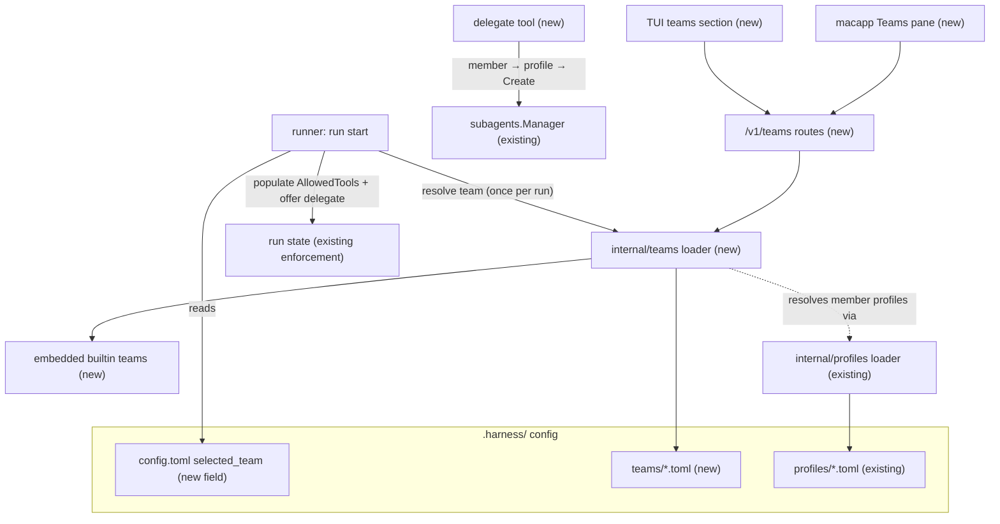
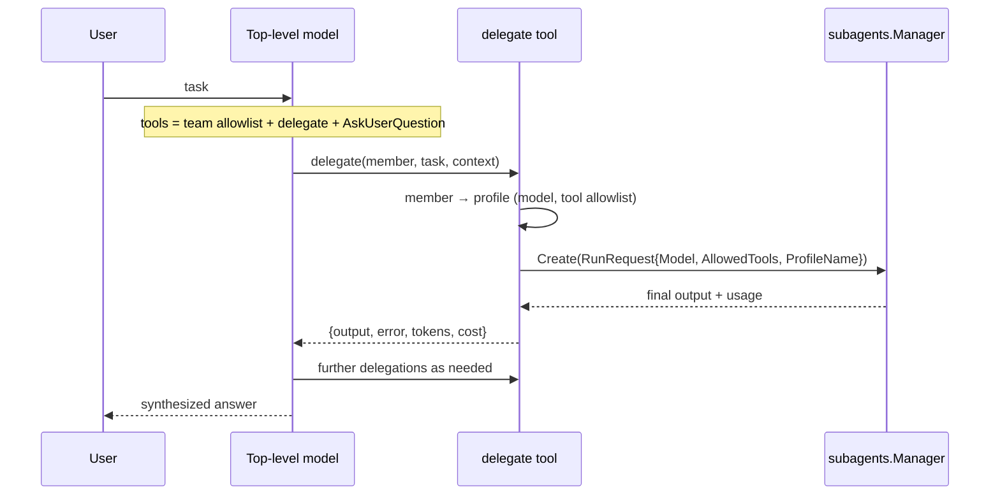

# Teams - Plan

## Goal Capsule

- **Objective:** Ship "Teams" — named bundles of agent members (each bound to a model + tool allowlist via an existing profile) that a project selects; while active, the top-level model delegates work through a `delegate` tool and can have its own tool list hard-filtered to force delegation. Configurable from TUI and macapp GUI; team definitions live at project and user tiers, and each project persists its selected team.
- **Authority:** This plan's Product Contract governs behavior; KTDs govern mechanism. Repo conventions (CLAUDE.md, existing route/loader patterns cited per unit) override incidental details here.
- **Stop conditions:** Stop and surface if (a) `RunRequest.AllowedTools` enforcement turns out not to cover a tool-offering path the team filter needs, (b) subagent result metadata (tokens/cost) is not retrievable from the existing subagent manager, or (c) any unit requires changing the workflow engine's `AgentOpts` contract.
- **Execution profile:** 8 PR-sized units, dependency-ordered U1→U2→U3/U4→U5→U6/U7, U8 last. Each unit lands as its own PR per repo merge discipline.

---

## Product Contract

### Summary

Add a `Teams` subsystem: TOML-defined teams cascade project → user → embedded builtins (like profiles); a selected team activates a roster-aware `delegate` tool on top-level runs and optionally shrinks the top-level tool list; HTTP routes plus TUI and macapp settings surfaces manage definitions and selection.

### Problem Frame

The harness has per-run model/tool selection (profiles, workflow `AgentOpts`) but no way to bundle a working set of specialized agents — planner, reviewer, fast implementor, UI tester, researcher — and make the top-level model use them. Users must hand-wire delegation per run. There is also no enforcement that a top-level model delegates rather than doing everything itself: profile tool allowlists are display-only today and nothing composes multiple profiles into a selectable unit.

### Requirements

**Team model and storage**

- R1. A team is a named bundle of members; each member has a name, a description, and a profile reference that supplies its model and tool allowlist.
- R2. Teams load from project `.harness/teams/`, then user `~/.harness/teams/`, then embedded builtins; on name conflict the nearer tier shadows, and listings surface each team's source tier.
- R3. One builtin default team, `core`, ships embedded in the binary, referencing builtin profiles; existing `reviewer` and `researcher` builtin profiles are reused, and `planner`, `implementor`, and `ui-tester` builtin profiles are added. A second `ui` builtin team is deferred (see Scope Boundaries).

**Selection and activation**

- R4. A project persists its selected team as `selected_team` in `.harness/config.toml` (hot-reloadable); a run request can override the active team by name.
- R5. When a team is active on a top-level run, the model is offered a `delegate` tool whose description embeds the roster: member names, descriptions, and capability summaries.
- R6. `delegate(member, task, context?)` runs the named member as a subagent under that member's profile model and tool allowlist and returns the member's output, error status, and token/cost usage.
- R7. A team may define a top-level tool allowlist; when set, the top-level model's tools are hard-filtered to that list (plus the `delegate` tool and the force-granted `AskUserQuestion`), at both offering time and call time. Filtering forces tool-backed work through delegation; it does not prevent the model from answering pure-reasoning tasks directly.
- R8. With no team selected, harness behavior is unchanged and `delegate` is not offered.

**Configuration surfaces**

- R9. HTTP API: list teams with source tier, get one team, create/update a team in the project or user tier, and read/set the selected team.
- R10. TUI: a teams section to view rosters, select the active team, and edit team definitions.
- R11. macapp GUI: a Teams settings pane to view rosters, select the active team, and create/update teams.

**Lifecycle and failure behavior**

- R12. Resolution failures — selected team not found, member profile missing, member profile's model not configured — produce actionable errors naming the team and the failing member resource at selection or dispatch time, never silent degradation.
- R13. Continuation runs keep the source run's tool-policy snapshot; changing the selected team takes effect on the next new run, and the continuation policy notice reports when the stored selection differs from the snapshot.

### Acceptance Examples

- AE1. **Covers R7, R6.** Given team `core` is active with a top-level allowlist that excludes `edit_file`, when the top-level model calls `edit_file` it is denied, and when it calls `delegate(member: "implementor", task: ...)` the implementor subagent runs and can edit files.
- AE2. **Covers R6.** Given `delegate(member: "reviewer", ...)`, the subagent run uses the model configured in the `reviewer` profile, not the top-level run's model.
- AE3. **Covers R8.** Given no `selected_team` and no run-level override, the tool catalog offered to the model is byte-identical to today's.
- AE4. **Covers R12.** Given team `core` references profile `implementor` and that profile file is deleted from every tier, selecting the team (or dispatching to the member) fails with an error naming both `core` and `implementor`.
- AE5. **Covers R12.** Given `selected_team` names a team that exists in no tier, starting a run fails with an error naming the missing team.
- AE6. **Covers R5, R6.** Given team `core` is active and the user asks for a code review, the top-level model calls `delegate(member: "reviewer", ...)` rather than reviewing inline, and synthesizes its answer from the member's output (proven by the manual delegation smoke in the Definition of Done).

### Scope Boundaries

**Deferred to Follow-Up Work**

- A second `ui` builtin team (the `ui-tester` builtin profile still ships for custom teams).
- Nested delegation: members do not receive the `delegate` tool in v1 (also sidesteps worktree subagents having no subagent manager).
- Parallel fan-out inside one `delegate` call — the model can still issue several `delegate` tool calls in one turn.
- Per-member approval gates and team-level cost budgets; v1 inherits the parent run's approval mode.
- `harnesscli teams` CLI subcommands (TUI and GUI are the v1 surfaces).
- Dynamic mid-run roster refresh; team edits apply to subsequent runs only.
- Workflow-engine integration (e.g. resolving a team member name inside script workflows' `agent()`); `AgentOpts` is untouched.

**Outside this product's identity**

- Team tool filtering as a security boundary. It is a delegation-forcing UX mechanism; safety remains with the approval broker, permission config, and plan-mode policy.
- Dynamic role addition at runtime; teams are static config.

---

## Planning Contract

### Key Technical Decisions

- KTD1. **Store teams in `.harness/`, mirroring the profiles cascade.** `internal/teams` loads `<name>.toml` from project `.harness/teams/` → user `~/.harness/teams/` → `go:embed` builtins, copying the tier logic of `loadProfileFromTiers` (`internal/profiles/loader.go:115`) and the embed pattern (`internal/profiles/loader.go:16`). (session-settled: user-approved — chosen over a new `.go-code/` dotfolder: `.harness/` is already the per-project home of config, profiles, and hooks.)
- KTD2. **Enforce the top-level filter through `RunRequest.AllowedTools` — no new mechanism.** Profile tool allowlists are display-only today; the only run-time enforcement is `RunRequest.AllowedTools`/`DeniedTools`, applied at offering time (`internal/harness/runner.go:2836`) and call time (`internal/harness/runner.go:2930`) and snapshotted for continuations (`internal/harness/runner.go:1610`). Team activation resolves the team and populates run-state allowed tools; the registry is never rebuilt (per-run registry re-root at `internal/harness/runner.go:1258` would drop registry-held state).
- KTD3. **One generic `delegate` tool, not per-member tools and not raw subagent exposure.** Roster lives in the tool description (single source of truth for context parity); result is structured `{output, error, tokens, cost}`; synchronous in v1. Offered only when a team is active on a top-level run. Roster text in the description is bounded, display-only data: member resolution and policy derive from the resolved team snapshot, never from description text.
- KTD4. **Member → profile is the resolution axis.** There is no agent-type registry (`cmd/harnessd/script_workflows.go:114` falls back AgentType→ProfileName). Dispatch resolves member → profile via the profiles loader, then calls the existing subagent manager (`internal/subagents/manager.go:228`) with `Model` and `AllowedTools` set explicitly from `profile.Tools.Allow` — `ProfileName` alone does not restrict tools (see KTD2).
- KTD5. **Active team is a per-run snapshot; selection is config plus per-run override.** `selected_team` is process-global config (the daemon is per project directory), classified hot-swappable in `ReloadClassification`; `RunRequest` gains a team-name override field (same shape as `ProfileName`). The team is resolved once at run start; mid-run edits affect future runs; continuations keep their snapshot and the policy notice reports divergence (extends `buildContinuationPolicyNotice`, `internal/harness/runner.go:1610-1621`). The snapshot is a defined run-state contract — resolved team name, source tier, member→profile bindings, and roster text stored on the run at start — and offering, dispatch, and continuations all read the snapshot, never live config.
- KTD6. **Approval and permissions are inherited, not merged.** Member subagents run through the existing subagent path with the parent approval broker; a member profile's permissions apply to the member's own run exactly as profiles do today. The team layer adds no permission arithmetic.
- KTD7. **The team allowlist must explicitly carry the survival set.** Under an active allowlist only `AskUserQuestion` is force-granted (`find_tool`/`skill` intentionally excluded, issue #527). Team activation always appends `delegate` to the resolved top-level allowlist; builtin teams' allowlists include read/search tools so the model can formulate and verify delegated work. Naming note: avoid `Role*` identifiers — `RoleModels` already means harness-internal primary/summarizer roles (`internal/harness/runner.go:129`); use `Member`.

### High-Level Technical Design

Component topology — where teams plug into existing pieces (new nodes marked):

Delegation loop with an active team (top-level tools filtered):

### Sources & Research

- Run-time tool enforcement and its snapshot semantics: `internal/harness/runner.go:2836-2955`, `internal/harness/runner.go:1610-1621`.
- Profile cascade + embedded builtins to mirror: `internal/profiles/loader.go:115`, `internal/profiles/loader.go:16`, `internal/profiles/builtins/reviewer.toml`.
- Subagent creation contract: `internal/subagents/manager.go:228-244`, `internal/subagents/inline_manager.go:56-63`, `internal/server/http_subagents.go:71`.
- Config field mechanics (two-struct merge + reload classes): `internal/config/config.go:227-324`, `internal/config/reload.go:64`.
- Route conventions: `internal/server/http_script_workflows.go:16-84`, `internal/server/http_model_settings.go:14-60`.
- TUI picker templates: `cmd/harnesscli/tui/components/profilepicker/`, theme selection persistence `cmd/harnesscli/tui/model.go:4749-4770`.
- macapp settings + client patterns: `macapp/Sources/GoCodeUI/SettingsView.swift:8`, `macapp/Sources/HarnessKit/HarnessClient.swift:265-344`.

---

## Implementation Units

### U1. `internal/teams` package: types, TOML loader cascade, builtin teams and profiles

- **Goal:** A `teams` package that parses, validates, and resolves team definitions across the three tiers, plus the embedded default content.
- **Requirements:** R1, R2, R3, R12 (validation half).
- **Dependencies:** none.
- **Files:** `internal/teams/team.go`, `internal/teams/loader.go`, `internal/teams/builtins/*.toml`, `internal/teams/loader_test.go`; `internal/profiles/builtins/planner.toml`, `internal/profiles/builtins/implementor.toml`, `internal/profiles/builtins/ui-tester.toml`.
- **Approach:**
  1. `Team{Name, Description, Members []Member, TopLevelTools []string}` and `Member{Name, Description, Profile string}` with TOML tags; use `Member`, never `Role` (KTD7 naming note).
  2. Loader mirrors `loadProfileFromTiers` and the `go:embed builtins/*.toml` pattern from `internal/profiles/loader.go`; exports `LoadTeam(name, dirs)`, `ListTeams(dirs)` returning source tier per entry.
  3. `Validate` enforces: every member's profile resolves through the profiles loader; member names are unique and non-empty; team names match a strict identifier grammar (no path separators or dot components — shared with U5's route validation); and a warning is raised when `TopLevelTools` is set but contains no read/search tool. Failures name the team and the offending member resource (R12).
  4. One builtin team `core` (planner, reviewer, implementor, researcher); builtin profiles follow the `[meta]/[runner]/[tools]` format of `internal/profiles/builtins/reviewer.toml`. The `ui-tester` profile ships for custom teams; a `ui` builtin team is deferred.
- **Patterns to follow:** tier/merge table-test style of `internal/harness/profile_tool_manifest_test.go:79-233` (tempdir tiers, embedded fallback).
- **Test scenarios:**
  - Project tier shadows user tier shadows builtin for the same team name; listing reports the winning tier.
  - Builtin `core` loads with zero on-disk files and all member profiles resolve.
  - Team referencing a nonexistent profile fails validation with team and profile names in the error.
  - Malformed TOML surfaces a parse error naming the file.
  - Duplicate or empty member names fail validation.
  - A traversal-shaped team name (`../evil`, `a/b`) fails the identifier grammar.
  - A `TopLevelTools` list with no read/search tool raises the validation warning.
  - `TopLevelTools` empty vs. populated round-trips through parse.
- **Verification:** `go test ./internal/teams/...` green; builtin content loads in a clean environment with no `.harness/` dirs.

### U2. Config and run-request plumbing: `selected_team` + per-run override

- **Goal:** Selection persists in config, hot-reloads, and reaches the runner; a run request can override it.
- **Requirements:** R4, R8 (selection half).
- **Dependencies:** U1.
- **Files:** `internal/config/config.go`, `internal/config/reload.go`, `internal/harness/types.go`, `internal/harness/runner.go`, `internal/config/config_test.go`, `internal/config/reload_test.go`.
- **Approach:**
  1. Add `SelectedTeam string` to `Config` with the full two-struct pattern: `rawConfig` pointer field, merge, `Defaults()`, and a hot-swappable `ReloadClassification` row.
  2. Add `TeamName string` to `RunRequest` (mirrors `ProfileName`); precedence: request override → config `selected_team` → none.
  3. Runner resolves the active team once at run start via `internal/teams`; resolution failure fails the run with the R12 error shape. Empty selection leaves the run untouched.
  4. Subagent runs never resolve a team: member runs created by dispatch carry team resolution suppressed, so a member cannot inherit the parent's team or the config selection.
- **Patterns to follow:** existing hot-swappable config fields in `internal/config/reload.go`; `ProfileName` handling in `internal/harness/runner.go:1178`.
- **Test scenarios:**
  - Config merge: project `selected_team` overrides user-level; absent field defaults to empty.
  - Reload classification exhaustiveness test still passes with the new row.
  - Run with `TeamName` override uses the override when config names a different team.
  - Run with `selected_team` naming a missing team fails with the actionable error, not a silent no-team run (AE5).
  - A subagent-created run ignores `selected_team` and any team override (no team inheritance).
- **Verification:** `go test ./internal/config/... ./internal/harness/...` green.

### U3. Top-level tool filtering on team activation

- **Goal:** An active team's `TopLevelTools` shrinks the top-level model's tools via existing run-state enforcement, with the survival set guaranteed and continuations reported honestly.
- **Requirements:** R7, R13.
- **Dependencies:** U2.
- **Files:** `internal/harness/runner.go`, `internal/harness/runner_test.go` (or the existing filtering test file).
- **Approach:**
  1. At run start, when the active team defines `TopLevelTools`, populate the run's allowed-tools state from it, always appending `delegate` (KTD7); teams with no `TopLevelTools` change nothing.
  2. Compose with, never replace, request-supplied `AllowedTools`/`DeniedTools` (intersection with request allowlist; denied still wins), preserving the documented precedence in `filteredToolsForRun`.
  3. Extend `buildContinuationPolicyNotice` to note when the current `selected_team` differs from the continuation's snapshotted policy (R13).
- **Execution note:** Add characterization coverage of `filteredToolsForRun`/`toolAllowedForRun` precedence before modifying them — this is the enforcement core other features (skill constraints, plan mode) rely on.
- **Test scenarios:**
  - Team allowlist active: excluded tool absent from offered tools and denied at call time; `delegate` and `AskUserQuestion` present.
  - Team allowlist plus request `DeniedTools` on `delegate`: denied wins (documenting the escape hatch).
  - No-team run: offered toolset identical to pre-change behavior (AE3, golden-list comparison).
  - Continuation of a team-filtered run keeps the snapshot; notice text appears when selection changed.
  - Plan mode + team filter active simultaneously: plan-mode gate still applies to mutations.
- **Verification:** `go test ./internal/harness/...` green including the new characterization tests.

### U4. `delegate` tool

- **Goal:** The dispatch tool: member → profile → subagent, structured result, roster-bearing description, offered only when a team is active on a top-level run.
- **Requirements:** R5, R6, R8 (tool half), R12 (dispatch half).
- **Dependencies:** U1, U2 (can build in parallel with U3).
- **Files:** `internal/harness/tools/core/delegate.go`, `internal/harness/tools/core/delegate_test.go`, `internal/harness/tools_default.go` (registration), runner wiring for conditional offering.
- **Approach:**
  1. Args `{member, task, context?}`; resolve member from the run's team snapshot; unknown member returns an error listing valid members.
  2. Build the subagent request with `Model` from the member profile and `AllowedTools` explicitly from `profile.Tools.Allow` (KTD4), plus `ProfileName` for isolation/MCP behavior it already controls; create via the existing subagent manager and wait synchronously.
  3. Return `{output, error, tokens, cost}`; do not include the transcript.
  4. Offering mechanism: `delegate` is registered once in the registry; `filteredToolsForRun` offers it only when the run state carries a team snapshot, and the per-run description is resolved from that snapshot following the plan-mode context-injection precedent (`internal/harness/plan_mode.go:283`). Members' subagent runs never receive `delegate` — dispatch suppresses team resolution on the member run (U2).
  5. Roster text renders as bounded display-only data (KTD3); a member whose profile model is not configured returns the R12 error shape naming team, member, and model.
- **Test scenarios:**
  - Dispatch to `reviewer` creates a subagent request carrying the reviewer profile's model and tool allowlist (AE2, assert on the captured request against a mock manager).
  - Unknown member name errors and names the roster.
  - Member profile missing at dispatch errors with team + profile names (AE4).
  - Subagent failure surfaces as a structured error result, not a tool crash.
  - Member profile referencing an unconfigured model errors with team, member, and model names.
  - An adversarial member description (instruction-shaped text) changes nothing about dispatch behavior — description is data, not policy.
  - Tool not offered when no team is active (AE3) and not offered inside a member's subagent run.
- **Verification:** `go test ./internal/harness/...` green; manual smoke: run with builtin `core` team and observe a delegation round-trip.

### U5. HTTP routes: teams listing, CRUD, selection

- **Goal:** Server surface backing the TUI and GUI.
- **Requirements:** R9, R2 (tier surfacing).
- **Dependencies:** U1, U2.
- **Files:** `internal/server/http_teams.go`, `internal/server/http_teams_test.go`, `internal/server/http.go` (ServerOptions + registration), `cmd/harnessd/main.go` (wiring).
- **Approach:**
  1. Routes: `GET /v1/teams` (list, each with source tier and member summary), `GET /v1/teams/{name}`, `PUT /v1/teams/{name}` (create/update; body carries target tier project|user; writes the TOML file), `GET/PUT /v1/teams/selection` (reads/sets `selected_team` in project config).
  2. Follow the per-file `registerTeamsRoutes(mux, ...)` style with a narrow local interface in the route file, nil-service 501 guard, scope checks, tenant gating returning 404, `writeJSON`/`writeError` (`internal/server/http_script_workflows.go` conventions). Authorization matrix: project-tier writes and the selection PUT require the admin scope (precedent: `/v1/config/reload`, `/v1/model-settings/providers` mutations); user-tier writes require the standard write scope; reads require the read scope.
  3. Team names in routes are validated against U1's identifier grammar before any path construction; the resolved file path must stay under the target tier's `teams/` directory.
  4. Builtin teams are read-only: `PUT` on a builtin name writes a shadowing project/user file (consistent with cascade semantics), never edits embedded content.
  5. The route file defines the JSON wire contract — snake_case fields, error envelope, tier semantics — with fixture examples the TUI and macapp clients (U6/U7) build against, so the two clients cannot drift.
  6. `GET /v1/teams` includes teams that fail validation, marked with their validation error, so clients can surface and repair broken definitions.
- **Test scenarios:**
  - List includes builtins with tier `builtin`; a project file shadowing a builtin lists once with tier `project`.
  - PUT project-tier team then GET returns it; TOML file exists under `.harness/teams/`.
  - PUT with a member referencing a missing profile returns a 400 naming the profile (validation from U1).
  - Selection PUT persists to config and GET reflects it; selecting a nonexistent team returns 400.
  - Non-admin project-tier PUT returns 403; user-tier PUT succeeds with the standard write scope.
  - PUT with a traversal-shaped name (`../x`, `a/b`) returns 400 before any file operation.
  - Unauthorized scope and cross-tenant requests follow existing 403/404 conventions.
- **Verification:** `go test ./internal/server/...` green (httptest + mock interface per repo convention).

### U6. TUI: teams section — picker, roster view, editing

- **Goal:** Select and inspect teams from the TUI; edit definitions without leaving the terminal.
- **Requirements:** R10.
- **Dependencies:** U5.
- **Files:** `cmd/harnesscli/tui/components/teampicker/` (model.go, view.go, messages.go), `cmd/harnesscli/tui/cmd_parser.go`, `cmd/harnesscli/tui/model.go`, `cmd/harnesscli/tui/keys.go` (if a binding is added; note ctrl+o is taken).
- **Approach:**
  1. `/teams` slash command opens a picker modeled on `profilepicker`, with selection persistence modeled on `themepicker.ThemeSelectedMsg` handling — but persisting via the U5 selection route rather than local config, so daemon state and GUI stay consistent.
  2. Picker rows show name, source tier, member count; a detail pane shows the roster (member, profile, model).
  3. Edit action opens the team's TOML in `$EDITOR` for project/user tiers (creating the shadow file for builtins via the U5 PUT semantics); after editor exit, re-validate through the server and surface errors in the status line.
  4. On a failed selection PUT (daemon error, team resolution failure), the picker stays open on the previous selection and shows the server error in the status line — the mirrored profilepicker applies selection locally and has no such failure mode, so this state is new.
- **Execution note:** Prefer smoke verification in the running TUI over exhaustive component tests; the repo's picker components carry thin unit coverage.
- **Test scenarios:**
  - Picker opens from `/teams`, lists teams with tiers, and selecting one issues the selection PUT and shows a confirmation status.
  - Selecting a team then starting a run uses the team (visible via the delegate tool appearing in the tool list).
  - Editing a team with a validation error shows the server's error message.
- **Verification:** `go build ./cmd/harnesscli` green; component tests for the picker model; manual TUI smoke against a local harnessd.

### U7. macapp GUI: Teams settings pane

- **Goal:** View, select, create, and update teams from the native app.
- **Requirements:** R11.
- **Dependencies:** U5.
- **Files:** `macapp/Sources/GoCodeUI/SettingsView.swift` (new `teams` Tab case + `TeamsTab` view), `macapp/Sources/HarnessKit/ClientTeams.swift` (new), `macapp/Tests/` (client decode tests).
- **Approach:**
  1. `ClientTeams.swift` extends `HarnessClient` with list/get/put/selection calls; `Decodable` structs with explicit snake_case `CodingKeys`, mirroring `ClientModelSettings.swift`.
  2. `TeamsTab`: team list with tier badges, roster detail, a picker for the selected team, a New Team action opening an empty editor, and a team editor whose roster is an editable list (add-member row, per-row delete; per-member name, description, and profile picked from the existing profiles list) plus a `top_level_tools` field so GUI round-trips preserve R7 policy; saving PUTs the team.
  3. Builtins render read-only with an "edit a copy" affordance matching the U5 shadowing semantics.
- **Test scenarios:**
  - Client decodes list/get/selection responses (fixture JSON from U5's wire contract).
  - PUT encodes the team with correct snake_case keys, including `top_level_tools` round-tripping intact.
  - Creating a new team with one member PUTs it and it appears in the list with tier `project`.
  - UI smoke: selecting a team updates the selection endpoint; editing a builtin creates a project-tier shadow.
- **Verification:** `swift test` in `macapp/` green; manual app smoke against a local harnessd.

### U8. Documentation

- **Goal:** Docs match shipped behavior.
- **Requirements:** all (traceability); no behavior change.
- **Dependencies:** U1–U7.
- **Files:** `docs/runbooks/teams.md` (new), `CLAUDE.md` (short subsystem note per existing epic-note convention), any route/tool catalog docs that enumerate `/v1/*` routes or core tools.
- **Approach:** Runbook covers: team TOML format with a full example, cascade and shadowing rules, `selected_team` + run override precedence, delegate tool contract, top-level filtering semantics including the survival set, and the TUI/GUI surfaces.
- **Test expectation:** none — documentation unit; verification is the docs-alignment reading pass required by CLAUDE.md ("public-facing docs stay aligned with current routes, run request fields, event names, tool catalog").
- **Verification:** runbook examples parse (paste the sample TOML into a loader test fixture in U1's suite).

---

## Verification Contract

| Gate | Command | Applies to |
|---|---|---|
| Unit tests | `go test ./...` | every unit; must be green before each PR merges |
| Regression script | `./scripts/test-regression.sh` | U2–U5 (runner/config/server behavior) |
| Server route tests | `go test ./internal/server/...` | U5 |
| macapp tests | `swift test` (in `macapp/`) | U7 |
| TUI build | `go build ./cmd/harnesscli` | U6 |
| Key-free smoke | `go test ./internal/server/... -run TestRunSmoke` | U2, U3 (must stay green) |

No key-free end-to-end delegation smoke exists: `HARNESS_PROVIDER=fake` is bypassed by per-run provider resolution (open issue #920). End-to-end delegation is verified manually against a real provider; automated proof is unit + httptest coverage per the scenarios above.

---

## Definition of Done

- All eight units merged to `main` as separate PRs, each with its unit's test scenarios implemented and green.
- AE1–AE6 each provable: AE2–AE5 by automated tests; AE1 and AE6 by the U3/U4 tests plus one manual delegation smoke recorded in the epic.
- `GET /v1/teams` and selection round-trip work from both the TUI and the macapp against the same daemon.
- No-team behavior verified unchanged (AE3 golden comparison in U3).
- Docs unit (U8) landed; CLAUDE.md note present.
- No abandoned experimental code left in the diff; branches deleted after squash-merge per repo discipline.

---

## Risks & Dependencies

- **Enforcement composition risk:** `AllowedTools` interacts with skill constraints, plan mode, and continuation snapshots; the U3 characterization-first execution note exists because regressions here affect every run. Mitigation: golden no-team comparison (AE3) plus precedence tests.
- **Survival-set trap:** under restriction only `AskUserQuestion` survives automatically (issue #527); a team allowlist that omits read tools leaves the model unable to formulate tasks. Mitigation: `delegate` force-appended in code; builtin teams model a sane allowlist; runbook documents it.
- **No e2e smoke** (issue #920): delegation loop correctness rests on unit tests plus manual smoke until the fake provider is fixed.
- **Naming collision:** `RoleModels` is taken by harness-internal roles; the plan standardizes on `Member`.
- **Worktree members:** a member profile using worktree isolation cannot itself spawn subagents (by design); harmless in v1 since members never get `delegate`, but the runbook should note it.
- **Project-supplied team definitions:** teams follow the same project-config trust posture as profiles and `.harness/config.toml` — declarative data, no execution — and a repo can already steer model/tool selection through the profiles cascade today. If untrusted-repo hardening becomes a goal, add a trust gate like the one project hooks require (`internal/hooks/hooks.go:192` precedent); flagged, not built, in v1.
